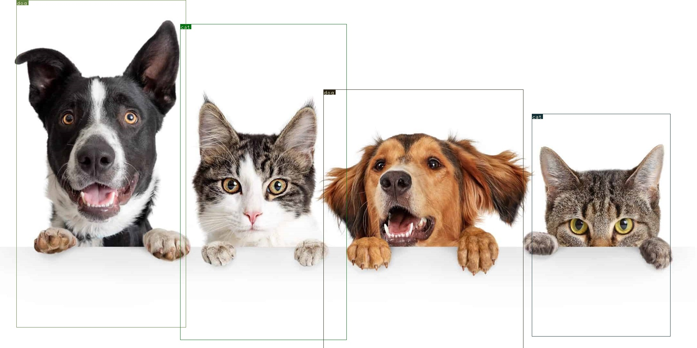

# Object Detector

Object detection using PyTorch and You Only Look Once (YOLO) algorithm.



## Additional Requirements

Weights: https://pjreddie.com/media/files/yolov3.weights

## Usage

To run the program, use the following commands:

```
pip install -r requirements.txt

python main.py -i <input image>
```

For a list of all options, use the help argument:

```
python main.py -h
```
